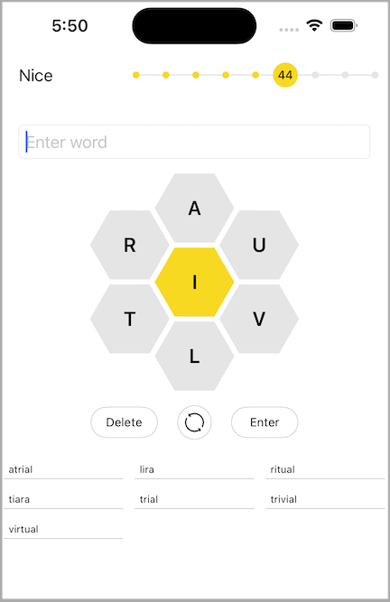

I cloned a popular NYT word puzzle for Swift/UIKit practice.  I didn't copy all of the UI/UX verbatim, for instance I had to make changes to fit the elements onto a mobile screen instead of a desktop.  I also only approximated relative sizes/visuals for things like buttons.  And in some cases, I made choices that accomodated my preferences (including the availability of an external keyboard).

Things I played around with:
- Matching main puzzle and score ladder widgets from the web version of the game
- Custom interactions with UIViews and CAShapeLayers
- Animations -- there was some trickery to animate UIKit + CALayers in sync
- Accomodating both portrait and landscape with size classes. Landscape is not the best in terms of usability, but does use the space better.

Example screenshot:

 

